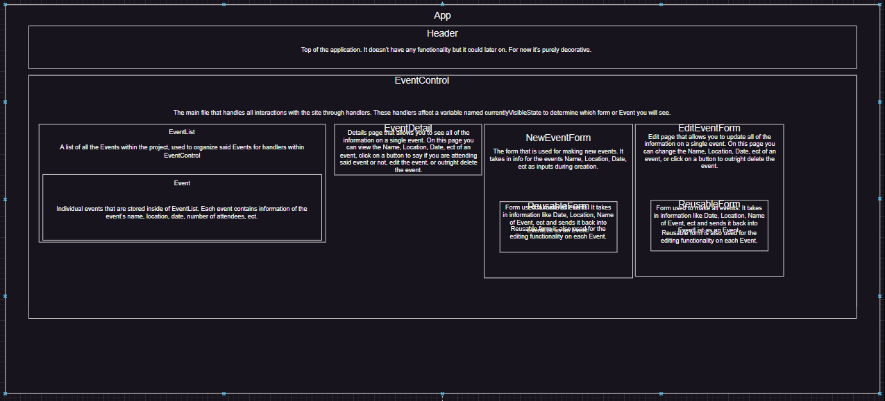

Event Logger
=============
By: Andrew Mickel
=============
An app used for keeping track of events

Description
----------------
A project used for recording notable events. It uses a reusable form to let the user create as many events as they want. They can create an event, view all the information of the event, edit the event, and delete the event. For the background and button designs I went with a space theme, so starry sky and green 

Technologies used
--------------------
* JavaScript
* HTML
* CSS
* React

Setup/installation instructions
---------------------
1. You will need Git bash to get this project working on your computer. Grab it here: [Git bash link]
2. Download the zip file from the green dropdown menu with the words < > Code on it.
3. Unzip the project into a folder of your choice, then access the folder until you see all the files.
4. Right click inside the project folder and click on "Git Bash Here" to open a command prompt.
5. Type the command "npm install" and hit enter. once the command is finished running, type in the command "npm run start" to open the event-logger project.
6. If done correctly then the project should automatically open in your browser.

Project requirements
--------------------
- [x] Add full CRUD functionality for types of events to be logged. For instance, in a bird-watching application, a user might add "Spotted Sandpiper" to indicate a viewing of that kind of bird.
- [x] Allow users to increment the event by one when there is a viewing, a play of the game, or so on. Users should also be able to decrement an event (for instance, if they made a mistake).

Additional exploration
----------------------
- [x] Add a background. Also make the background scale with the size of the display.
- [ ] Add a multiple pages function into the site for organization purposes.

Diagram
----------------------
[Diagram of project]

<!-- Table of contents
----------------------
| Time | Sheet |
| ---- | ------|
| Day | Hours |
|     |       |
|     |       |
|     |       |
|     |       |
|     |       |
|     |       | -->

Known Bugs
--------------------
No known bugs

License
--------------------
[MIT](./LICENSE.txt) Copyright (c) 2024 Andrew Mickel

[Diagram of project]: diagram.drawio
[Git bash link]: https://git-scm.com/downloads